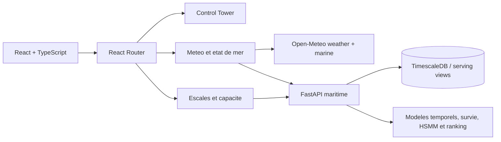

# PortFlow Maritime - Guide de passation frontend

Ce document explique le fonctionnement actuel du sous-projet React, la responsabilite de chaque
page, les contrats de donnees, les interactions deja implementees et les corrections a effectuer.
Il doit etre lu avant toute refonte afin de ne pas confondre une demonstration visuelle avec une
fonctionnalite reliee au backend.

## 1. Objectif du sous-projet

PortFlow Maritime est une tour de controle destinee a un operateur ou superviseur de Tanger Med.
Le frontend ne doit pas exposer les noms internes des experiences (`B61`, `B62`, etc.) a
l'utilisateur final. Il doit traduire les sorties scientifiques en trois questions metier :

1. Que se passe-t-il maintenant dans le port ?
2. Quelles conditions meteo-marines sont prevues et quel est leur impact potentiel ?
3. Quelles escales doivent etre examinees en priorite avec une capacite humaine limitee ?

La plateforme est une aide a la decision. Aucune action portuaire automatique ne doit etre
declenchee par le frontend.

## 2. Architecture generale



Technologies principales : React 18, TypeScript, Vite, Material UI, Apache ECharts, Nginx et
Docker. `VITE_API_BASE_URL` definit l'adresse de FastAPI. En Docker, Nginx relaie egalement
`/api/` vers `host.docker.internal:8092`.

## 3. Routage et coque visuelle

Les routes sont definies dans `src/routes/router.tsx` et `src/routes/paths.ts` :

| Route | Page | Role |
|---|---|---|
| `/control-tower` | `ControlTowerPage.tsx` | Vue operationnelle globale |
| `/weather` | `WeatherPage.tsx` | Conditions et previsions meteo-marines |
| `/capacity` | `CapacityPage.tsx` | Priorisation des escales a examiner |

Point important : `/control-tower` est actuellement placee en dehors de `MainLayout` et dessine
sa propre barre laterale et son propre en-tete. Les deux autres pages utilisent `MainLayout`,
`NavigationRail` et `Topbar`. Cette duplication explique une partie des incoherences de
dimensions, de typographie et de navigation. La correction recommandee est d'integrer les trois
pages dans une seule coque partagee.

Sur mobile, `NavigationRail` devient une barre inferieure a trois destinations. Sur desktop, elle
mesure 64 px puis 208 px sur les grands ecrans. `Topbar` affiche le contexte de la page et l'heure
de Tanger (`Africa/Casablanca`) mise a jour toutes les 30 secondes.

## 4. Page Control Tower

### 4.1 Role metier

Cette page doit devenir l'ecran de synthese de la salle de controle : situation instantanee,
unites supervisees, alertes, prevision probabiliste de flux et decisions a examiner. Elle doit
repondre a la question : **ou sont les tensions et quelle action humaine faut-il etudier ?**

### 4.2 Fonctionnement actuel

La page affiche :

- cinq KPI : arrivees prevues, occupation, unites actives, decisions ouvertes et fiabilite ETA ;
- une carte schematique du port avec zones, navires et camions ;
- trois recommandations de decision ;
- un graphique de flux realise, P50, bande P10-P90 et seuil operationnel ;
- la charge par etape (`Approche`, `ZRE`, `Scan`, `SAS`, `Terminal`) ;
- un tableau consolide des unites.

Interactions deja implementees :

- selection d'une unite depuis la carte ou le tableau ;
- activation/desactivation de la couche de charge et des trajectoires ;
- animation locale du curseur de replay et choix de vitesse ;
- boutons H+6, H+12, H+24 ;
- `Examiner` retire localement une recommandation ;
- `Localiser` selectionne l'unite correspondante sur la carte.

### 4.3 Limite critique

Cette page est actuellement une **demonstration locale**. Les KPI, unites, zones, decisions,
charges et series du graphique sont codes en dur dans les composants. Le bouton `Actualiser` ne
lance aucune requete. Le replay ne rejoue pas TimescaleDB : il anime seulement un pourcentage.
Le changement d'horizon modifie la charge affichee, mais le graphique probabiliste conserve ses
series statiques.

La prochaine IA doit soit connecter cette page aux endpoints `replay`/`operations`, soit retirer
les controles qui donnent l'impression d'une fonction reelle.

### 4.4 Composants principaux

- `ControlTowerPage.tsx` : composition et etat local.
- `ControlTowerMap.tsx` : carte schematique et replay visuel local.
- `ControlTowerForecastChart.tsx` : graphique ECharts statique.
- `PortflowKpi.tsx` : carte KPI reutilisable.
- `PortflowPanel.tsx` : cadre de section reutilisable.

## 5. Page Meteo et etat de mer

### 5.1 Role metier

Cette page est la plus proche d'un produit fonctionnel. Elle doit repondre a :
**quelles conditions vont toucher les approches de Tanger Med et quand faut-il renforcer la
vigilance ?**

Elle separe volontairement deux sources :

1. Open-Meteo pour la situation actuelle et les series horaires accessibles en direct ;
2. FastAPI pour les sorties gouvernees des modeles, leur validation et l'impact sur les navires.

### 5.2 Chargement des donnees

`WeatherPage.tsx` lance en parallele :

- `liveMetoceanApi.getDashboard()` ;
- `metoceanApi.getDashboard()`.

Le chargement est relance toutes les cinq minutes lorsque l'actualisation automatique est active.
Les appels utilisent `AbortController` afin d'annuler une requete si la page est demontee. Une
source peut echouer sans supprimer les donnees de l'autre source.

Open-Meteo utilise les coordonnees de Tanger Med `(35.891, -5.501)`, 24 heures passees et 72
heures futures. Les variables incluent temperature, humidite, pression, pluie, vent, rafales,
hauteur/direction/periode des vagues, houle, temperature de mer et courant.

FastAPI fournit trois niveaux scientifiques :

- previsions gouvernees et probabilistes (`p10`, `p50`, `p90`, modele source, horizon) ;
- selection d'un challenger augmente et resultats de validation ;
- score d'exposition meteo-marine combine au risque temporel d'une escale.

Les noms d'experiences restent internes. Pour l'utilisateur, on affiche la prevision, son
incertitude, sa disponibilite operationnelle et son impact, pas `B62A` ou `B62B`.

### 5.3 Zones de l'interface

1. **En-tete dynamique** : date et heure de Tanger, derniere mise a jour, actualisation manuelle.
2. **Carte du detroit** : Tanger Med, Algesiras, routes Atlantique/Mediterranee et point
   meteo-marin. Les infobulles affichent les observations actuelles.
3. **Ajuster l'analyse** : horizon 12/24/72 h, focus temperature/vagues/combine, unite C/F et seuil
   de vague entre 0,5 et 4 m.
4. **Resultat de l'analyse** : temperature a l'horizon, pic de vague, rafales/pluie et impact
   operationnel indicatif.
5. **KPI meteo-marins** : temperature, vague, vent et pression avec mini-series.
6. **Trajectoire** : 24 h observees en trait plein et futur en pointilles ; le seuil de vague est
   une ligne horizontale.
7. **Etat de mer detaille** : direction, periode, houle et temperature de surface.
8. **Activite recente** : disponibilite des sources et fraicheur de mise a jour.

### 5.4 Calculs executes dans le navigateur

Les controles ne reentrainent aucun modele. Ils filtrent les series deja recues et recalculent :

- la valeur la plus proche de l'horizon choisi ;
- les minimums et maximums sur la fenetre ;
- le nombre de points depassant le seuil de vague ;
- un niveau d'impact indicatif a partir des vagues, rafales et precipitations.

Il faut conserver cette distinction dans le texte de l'interface : il s'agit d'une exploration de
previsions existantes, pas d'une nouvelle inference du modele.

### 5.5 Limites actuelles

- La carte est une carte ECharts 2D, pas une carte AIS temps reel ni une scene 3D.
- Les routes d'approche et points sont statiques.
- Les appels Open-Meteo partent directement du navigateur ; un proxy backend serait preferable
  pour la resilience, le cache et l'audit.
- Les sorties de gouvernance/modeles sont chargees mais certaines sont peu visibles dans la page.
- L'impact operationnel calcule cote client est indicatif et ne doit pas etre presente comme un
  resultat causal.

## 6. Page Escales et capacite

### 6.1 Role metier

Cette page transforme un grand nombre de scores en une file de travail compatible avec la
capacite humaine. Elle repond a : **quelles escales faut-il examiner pendant le prochain cycle de
decision ?**

L'objectif n'est pas de classer tous les navires comme dangereux. Il est de selectionner les
quelques dossiers qui maximisent l'utilite d'une revue operateur sous une contrainte `top-k`.

### 6.2 Donnees et intelligence hybride

Le backend renvoie pour chaque escale :

- le score de risque temporel ;
- la probabilite de retard superieur a 3 h ;
- les hazards a 6, 12 et 24 h ;
- le temps restant probabiliste P10/P50/P90 ;
- l'etat operationnel HSMM et sa confiance ;
- le rang dans la fenetre et la selection dans la watchlist ;
- les indicateurs de gouvernance interdisant la promotion ou l'action automatique.

La logique hybride se trouve donc surtout en amont : estimation du temps restant/survie,
probabilites de retard, etat temporel HSMM, puis ranking sous contrainte de capacite. Le frontend
ne refait pas ces calculs ; il les explique et les rend actionnables humainement.

### 6.3 Chargement et cache

`capacityApi.getDashboard()` charge en parallele :

- `/api/v1/maritime/capacity-ranking/status` ;
- `/api/v1/maritime/capacity-ranking/snapshot`.

La page utilise le role `VALID_SELECT`, demande jusqu'a 250 decisions et conserve le dernier
dashboard dans `sessionStorage`. Si une seule des deux requetes echoue, l'autre reste exploitable.
Si les deux echouent, le message `La vigilance des escales est indisponible` est affiche.

Pour le replay, six snapshots espaces de six heures sont demandes avant l'instant d'ancrage. Ils
defilent toutes les huit secondes. La trajectoire d'une escale est chargee par
`/port-calls/{id}/timeline` et egalement mise en cache de session.

### 6.4 Zones et interactions

1. **Barre de replay historique** : precedent, pause/lecture, suivant, instant analyse et synchro.
2. **Synthese** : escales actives, revues planifiees, capacite disponible, duree du cycle.
3. **Evolution du risque** : maintenant, +3 h, +6 h et +12 h pour l'escale selectionnee.
4. **File de vigilance** : groupes critique, vigilance et normal, filtres et navigation clavier.
5. **Fiche escale** : risque, P(retard > 3 h), P10/P50/P90, etat HSMM et recommandation humaine.
6. **Trajectoire decisionnelle** : evolution historique du score, du temps restant et des etats.

Le bouton de preparation de revue ne transmet rien au SI portuaire. Il change seulement un etat
React local et affiche explicitement `Brouillon local`.

### 6.5 Limites actuelles

- Aucun workflow persistant d'assignation, commentaire, validation ou audit operateur.
- Pas de WebSocket ; actualisation toutes les cinq minutes.
- Le replay repose sur des snapshots historiques disponibles, pas sur un flux live.
- La meteo n'est pas encore affichee dans la fiche d'escale, meme si l'architecture scientifique
  permet de combiner exposition meteo et risque temporel.
- Le cache de session masque temporairement une panne mais ne remplace pas une strategie de
  synchronisation/versionnement.

## 7. Etat global et dette technique

### Ce qui est reellement connecte

- Meteo actuelle Open-Meteo et marine Open-Meteo.
- API gouvernee de prevision meteo-marine.
- API de ranking capacitaire et timelines d'escales.
- Etats de chargement, erreurs partielles, cache de session et actualisation periodique.

### Ce qui est encore simule ou local

- KPI, carte, unites, decisions et prevision de la Control Tower.
- Replay de la carte Control Tower.
- Preparation de revue sur la page Capacite.
- Notifications, collaboration, assignation et actions operationnelles.

### Probleme transversal important

`ReplayProvider` enveloppe actuellement toute l'application et declenche plusieurs appels
`/replay` et `/operations`, alors qu'aucune page active n'utilise directement `useReplay`. Seul un
ancien composant `MaritimePageHeader` le consomme et ce composant n'est pas monte. Cela produit du
trafic inutile et peut generer des erreurs invisibles. Il faut connecter explicitement la Control
Tower a ce provider ou retirer le provider global jusqu'a son utilisation.

## 8. Priorites pour la prochaine IA

### P0 - Corriger la verite fonctionnelle

1. Mettre les trois routes sous `MainLayout` et supprimer la coque dupliquee de Control Tower.
2. Connecter Control Tower aux API `replay` et `operations`, sans conserver de chiffres fictifs.
3. Faire en sorte que l'horizon modifie reellement la courbe et les KPI.
4. Brancher `Actualiser` sur un chargement reel et afficher loading/error/empty states.
5. Ne jamais activer une action automatique lorsque le contrat backend l'interdit.

### P1 - Construire le workflow operateur

1. Ajouter une API de decisions persistantes : brouillon, assigne, en cours, valide, rejete.
2. Enregistrer auteur, horodatage, commentaire, version du modele et donnees utilisees.
3. Relier une escale a son exposition meteo-marine dans la fiche capacite.
4. Ajouter filtres metier, recherche, pagination/virtualisation et liens entre carte, escale et
   decision.

### P2 - Qualite frontend

1. Centraliser les tokens de couleur, typographie, espacements et surfaces dans un seul theme.
2. Ajouter tests unitaires des transformations et tests d'integration des trois parcours.
3. Tester desktop/mobile avec captures Playwright et verifier les etats sans donnees.
4. Reduire les bundles ECharts et conserver le lazy loading des pages.
5. Ajouter accessibilite clavier, focus visible, libelles et respect de `prefers-reduced-motion`.

## 9. Regles que la prochaine IA ne doit pas casser

- Ne pas afficher les codes d'experience internes aux operateurs.
- Ne pas transformer une validation retrospective en promesse de production.
- Ne pas utiliser TEST pour choisir un modele ou un seuil.
- Ne pas melanger donnees synthetiques et resultats reels sans etiquette explicite.
- Ne pas presenter un score d'association ou d'exposition comme une causalite.
- Conserver P10/P50/P90 et la largeur d'intervalle : l'incertitude fait partie du produit.
- Toute recommandation doit rester explicable, reversible et soumise a validation humaine.

## 10. Fichiers de reference

- `src/routes/router.tsx` : composition des routes.
- `src/layouts/main-layout/` : coque partagee desktop/mobile.
- `src/pages/maritime/ControlTowerPage.tsx` : synthese actuellement simulee.
- `src/pages/maritime/WeatherPage.tsx` : orchestration des donnees meteo.
- `src/components/sections/maritime/MetoceanAnalyticsDashboard.tsx` : interface meteo complete.
- `src/pages/maritime/CapacityPage.tsx` : watchlist et fiche escale.
- `src/services/` : tous les contrats HTTP.
- `src/types/` : schemas TypeScript des reponses JSON.
- `src/theme/portflowPalette.ts` et `DESIGN_SYSTEM.md` : identite visuelle.
- `Dockerfile`, `nginx.conf`, `deploy-live-metocean-ui.ps1` : publication locale.

## 11. Demarrage sur une autre machine

```powershell
git clone "https://github.com/btissam75/portflow-maritime.git"
cd portflow-maritime
pnpm install --frozen-lockfile
$env:VITE_API_BASE_URL = "http://localhost:8092"
pnpm dev
```

Sans FastAPI, la page Control Tower reste visible car elle est simulee. Les pages Meteo et
Capacite doivent afficher des etats partiels ou indisponibles selon les sources accessibles.
