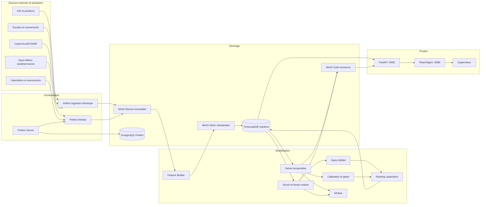

# PortFlow Maritime - Guide complet de la plateforme

## 1. Objet du guide

Ce document est la reference technique et fonctionnelle du depot `portflow-maritime`.
Il permet a un developpeur, un data engineer, un data scientist, un exploitant ou une autre IA de :

1. comprendre l'objectif metier du projet ;
2. comprendre le trajet complet de la donnee jusqu'a l'interface ;
3. demarrer la plateforme sur une nouvelle machine ;
4. identifier le role de React, FastAPI, Prefect, TimescaleDB, MinIO et MLflow ;
5. comprendre les modeles et les regles de gouvernance ;
6. poursuivre le projet sans casser les contrats temporels ou scientifiques ;
7. diagnostiquer les erreurs les plus frequentes ;
8. distinguer ce qui est exploitable, experimental, shadow ou non autorise en production.

Le depot est organise comme un monorepo :

```text
portflow-maritime/
|-- src/                         Frontend React/TypeScript
|-- public/                      Ressources publiques du frontend
|-- Dockerfile                   Image Nginx du frontend
|-- deploy-live-metocean-ui.ps1  Publication locale de l'interface
|-- backend/                     Plateforme data, ML et API
|   |-- services/
|   |-- prefect_flows/
|   |-- dags/
|   |-- infra/
|   |-- scripts/
|   |-- compose*.yaml
|   `-- prefect.yaml
|-- FRONTEND_HANDOFF.md          Guide des pages React
|-- DESIGN_SYSTEM.md             Regles visuelles
|-- TECHNICAL_ARCHITECTURE.md    Reference d'architecture historique
`-- PLATFORM_ENGINEERING_GUIDE.md
```

Les donnees reelles, les volumes Docker, les mots de passe, les sauvegardes et les modeles
entraines ne sont pas versionnes dans Git. Le code sait les recreer ou les reconnecter, mais un
clone Git ne contient volontairement pas les donnees privees de Tanger Med.

## 2. Objectif metier

PortFlow Maritime est une tour de controle decisionnelle pour la supervision portuaire. Le projet
ne se limite pas a predire un nombre de navires. Il cherche a transformer des observations
heterogenes en decisions operationnelles explicables.

Les questions principales sont :

- Quelles escales risquent de depasser un seuil de retard ?
- Combien de temps reste-t-il probablement avant la fin d'une escale ?
- Dans quel etat temporel se trouve une escale : fluide, sous pression, congestionnee ou critique ?
- Quelles escales doivent etre examinees en priorite sous une capacite d'intervention limitee ?
- Comment la meteo et l'etat de mer vont-ils evoluer ?
- Comment les conditions de vent, visibilite, houle et vagues affectent-elles le risque navire ?
- Les previsions sont-elles suffisamment calibrees et recentes pour etre affichees ?
- Une recommandation provient-elle de donnees disponibles au moment de la decision ?

La valeur ajoutee vient de la combinaison de cinq intelligences :

1. **Series temporelles** pour anticiper les trajectoires meteo, vagues et flux.
2. **Survie dynamique** pour estimer le temps restant et le risque de depassement.
3. **Etats temporels** pour stabiliser l'interpretation d'une trajectoire dans le temps.
4. **Ranking capacitaire** pour choisir les dossiers les plus utiles a traiter maintenant.
5. **Gouvernance point-in-time** pour empecher les fuites temporelles et les promotions abusives.

## 3. Positionnement produit

La plateforme est un systeme d'aide a la decision, pas un pilote automatique du port.

```text
Donnees observees
      -> qualite et disponibilite
      -> features point-in-time
      -> previsions probabilistes
      -> calibration
      -> etat temporel
      -> ranking sous contrainte
      -> API read-only
      -> interface operateur
      -> decision humaine auditee
```

Les actions automatiques sont interdites tant que les validations fresh-forward et les contrats
metier ne sont pas confirmes. Un statut `READY_FOR_*_SHADOW` signifie que le composant peut etre
observe en parallele des operations, pas qu'il peut agir automatiquement.

## 4. Architecture generale



## 5. Role de chaque technologie

### 5.1 React et TypeScript

React porte l'experience operateur. Il affiche les cartes, graphiques, chronologies, alertes et
explications. TypeScript protege les contrats JSON et reduit les erreurs d'integration.

React ne doit jamais :

- entrainer un modele ;
- recalibrer une probabilite ;
- inventer une observation reelle ;
- ecrire directement dans TimescaleDB ;
- transformer un replay en donnee live ;
- masquer un statut `shadow`, `stale` ou `production_allowed=false`.

### 5.2 FastAPI

FastAPI est la couche de serving read-only. Il :

- lit les tables `serving` de TimescaleDB ;
- valide les parametres avec Pydantic ;
- fournit des schemas OpenAPI dans `/docs` ;
- expose les previsions, scorecards, timelines et statuts de gouvernance ;
- retourne une erreur explicite si une source requise est indisponible.

Le service est publie sur `http://localhost:8092`.

### 5.3 Prefect

Prefect orchestre les workflows data science recents. Il gere :

- les deployments versionnes ;
- les executions manuelles ou planifiees ;
- la concurrence et les work queues ;
- les limites CPU/RAM ;
- la progression, les erreurs et les retries ;
- la publication atomique des artefacts ;
- les contrats de verification apres entrainement ou replay.

Prefect utilise sa propre base PostgreSQL. Cette base ne contient pas les donnees maritimes.

### 5.4 Airflow

Airflow reste present pour les pipelines historiques d'ingestion et de transformation NetCDF.
Il ne doit pas etre confondu avec Prefect. La cible a moyen terme est de documenter clairement
les proprietaires de chaque pipeline puis d'eviter deux orchestrateurs pour un meme flux.

### 5.5 TimescaleDB

TimescaleDB est PostgreSQL avec des primitives de series temporelles. Il contient :

- observations meteo-marines ;
- positions et evenements AIS ;
- escales portuaires ;
- landmarks dynamiques ;
- features point-in-time ;
- predictions et intervalles ;
- decisions shadow ;
- historiques de replay ;
- tables stables lues par FastAPI.

La base maritime est distincte de la base Prefect.

### 5.6 MinIO

MinIO est le data lake S3 local :

- `bronze-maritime` : payloads sources immuables ;
- `silver-maritime` : donnees standardisees et controlees ;
- `gold-maritime` : datasets, rapports, modeles et politiques versionnes ;
- `mlflow-artifacts` : artefacts suivis par MLflow.

Les fichiers Bronze sont nommes par hash. Ils ne doivent jamais etre modifies en place.

### 5.7 MLflow

MLflow suit les experiences, parametres, metriques et artefacts. Il ne remplace pas les gates de
gouvernance : un modele enregistre dans MLflow n'est pas automatiquement autorise en production.

### 5.8 Docker Compose

Docker Compose fournit un environnement reproductible. Les familles de fichiers sont :

| Fichier | Usage |
|---|---|
| `backend/compose.yaml` | TimescaleDB, MinIO, MLflow, Grafana. |
| `backend/compose.prefect.yaml` | Prefect DB, Redis, Server, Services, Worker. |
| `backend/compose.platform.yaml` | FastAPI et frontend React/Nginx. |
| `backend/compose.airflow.yaml` | Airflow historique. |
| `backend/compose.features.yaml` | Feature Builder NetCDF/xarray. |
| `backend/compose.training.yaml` | Environnement d'entrainement. |
| `backend/compose.ais.yaml` | Services lies a l'AIS. |

## 6. Organisation du backend

```text
backend/
|-- services/
|   |-- platform_api/       FastAPI et routes metier
|   |-- feature_builder/    Transformations xarray et features
|   `-- model_trainer/      Baselines, calibration et challengers
|-- prefect_flows/          Flows Prefect B58 a B62
|-- dags/                   DAGs Airflow historiques
|-- infra/
|   |-- timescaledb/init/   Bootstrap SQL
|   |-- prefect/            Image du worker scientifique
|   |-- platform-api/       Image FastAPI
|   |-- feature-builder/    Image xarray
|   |-- model-trainer/      Image d'entrainement
|   |-- mlflow/             Image et lancement MLflow
|   |-- minio/              Image MinIO epinglee
|   `-- grafana/            Provisioning Grafana
|-- scripts/                Demarrage, verification et arret
|-- tools/                  Audits ponctuels
|-- prefect.yaml            Catalogue des deployments
|-- .env.example            Contrat de configuration sans secret
`-- compose*.yaml           Topologie des services
```

Convention Prefect :

- `*_core.py` contient la logique scientifique pure ;
- `*_job.py` gere I/O, TimescaleDB, MinIO, audit et materialisation ;
- `*_flow.py` declare le flow Prefect et les taches ;
- `*_models.py` contient une implementation de modele quand elle est separee.

Cette separation permet de tester le calcul sans lancer toute l'infrastructure.

## 7. Cycle de vie des donnees

### 7.1 Bronze

Une collecte Open-Meteo issue-time stocke le payload original avec :

```text
endpoint_family
issue_at
requested_at
available_at
response_ms
payload_hash
object_uri
```

Exemple d'arborescence :

```text
s3://bronze-maritime/external/open-meteo/issue-time/
  endpoint=weather|marine/
  date=YYYY-MM-DD/
  issue_at=YYYYMMDDTHHMMSSZ/
  <sha256>.json
```

### 7.2 Silver

Le Silver applique :

- normalisation des noms et unites ;
- conversion UTC ;
- controle des directions temporelles ;
- deduplication ;
- flags de qualite physique ;
- alignement spatial autour de Tanger Med ;
- Parquet compresse et versionne.

### 7.3 Gold

Le Gold contient les jeux de donnees de modelisation et rapports :

```text
s3://gold-maritime/datasets/<pipeline>/version=<n>/
s3://gold-maritime/reports/<pipeline>/version=<n>/
s3://gold-maritime/models/<pipeline>/version=<n>/
s3://gold-maritime/scenarios/<pipeline>/version=<n>/
```

Les scenarios synthetiques sont separes des observations reelles. Ils ne doivent jamais etre
places dans TEST et ne doivent jamais remplacer une cible reelle.

### 7.4 Serving

Les resultats valides sont materialises dans des tables `serving`. FastAPI lit ces tables au lieu
de recalculer les modeles pour chaque requete. Cela rend l'API stable et auditable.

## 8. Semantique temporelle et anti-fuite

Le coeur scientifique du projet est la disponibilite point-in-time.

| Temps | Signification |
|---|---|
| `issue_at` | Instant d'emission d'une prevision. |
| `requested_at` | Instant ou la source a ete appelee. |
| `available_at` | Instant ou l'information etait reellement disponible. |
| `valid_at` | Instant auquel la prevision s'applique. |
| `landmark_at` | Instant d'observation dynamique d'une escale. |
| `decision_at` | Instant de calcul de la recommandation. |
| `target_at` | Instant futur utilise pour construire la cible. |

Regles critiques :

```text
source_time <= available_at <= decision_at
landmark_at <= decision_at
target_at > decision_at
train.target_at < valid.decision_at
valid.target_at < test.decision_at
```

Un split aleatoire n'est pas acceptable pour mesurer la generalisation temporelle. Le projet
utilise des splits chronologiques, rolling-origin et purges entre les periodes.

Les reanalyses retrospectives peuvent enrichir une etude scientifique, mais elles doivent porter
un role `RESEARCH_ONLY` si elles n'etaient pas disponibles au moment historique de la decision.

## 9. Variables et familles de features

Les datasets combines peuvent contenir les familles suivantes :

| Famille | Exemples | Role |
|---|---|---|
| Escale | phase, temps ecoule, ETA/ATA, file | Etat operationnel. |
| Navire | categorie, dimensions, tirant d'eau | Capacite et comportement. |
| Historique | delais passes, temps de service | Priors propres au contexte. |
| Calendrier | heure, jour, saison, fete | Saisonnalite connue a l'avance. |
| Evenements | Ramadan, Aid, fin d'annee, jours feries | Contexte explicite. |
| Meteo | vent, rafales, pluie, visibilite | Contraintes atmospheriques. |
| Mer | hauteur, periode, direction, houle | Contraintes de navigation. |
| Physique | composantes vent/vague, exposition relative | Relations interpretrables. |
| Capacite | charge, backlog, pression | Priorisation operationnelle. |
| Qualite | missingness, source, fraicheur | Confiance de la prediction. |

Les features derivees du futur ne sont autorisees que si elles sont connues a l'instant de
decision, par exemple un calendrier deterministe ou une prevision issue-time archivee.

## 10. Architecture de modelisation

### 10.1 Series temporelles

Les benchmarks incluent des baselines et des modeles avances :

- naive saisonnier et historique ;
- regression dynamique ;
- distributions de comptage Negative Binomial ;
- N-HiTS ;
- PatchTST ;
- Chronos-2 via AutoGluon TimeSeries ;
- intervalles conformes ou quantiles natifs.

Le meilleur modele est choisi par cible et horizon sur VALID. TEST est utilise une seule fois
comme diagnostic gele.

### 10.2 Cascade meteo vers vagues vers navires

La famille B62 implemente une cascade probabiliste :

```text
historique meteo/marine
      -> Chronos-2 ou baseline par variable/horizon
      -> quantiles p10/p50/p90 meteo et vagues
      -> features d'exposition navire
      -> estimation d'impact et de risque
      -> affichage des intervalles et de la confiance
```

Cette cascade ne prouve pas une causalite. Elle mesure une association predictive et propage
l'incertitude jusqu'a l'impact navire.

### 10.3 Temps restant et survie

La famille B61B combine :

- CatBoost pour les interactions tabulaires ;
- GRU partage pour la trajectoire des landmarks ;
- survie discrete pour le risque conditionnel dans le temps ;
- quantiles du temps restant ;
- mixture of experts pour adapter la prediction au contexte ;
- calibration probabiliste et intervalles conformes.

Les sorties utiles sont :

```json
{
  "risk_gt_3h": 0.42,
  "risk_gt_6h": 0.18,
  "remaining_time_p10_h": 2.1,
  "remaining_time_p50_h": 4.8,
  "remaining_time_p90_h": 9.7,
  "confidence": "medium"
}
```

### 10.4 HSMM et etats temporels

Le HSMM ajoute une duree explicite aux etats latents. Il evite qu'une escale saute d'un etat a un
autre a chaque observation. Les challengers B61D ont ete compares a la politique de reference.
Un challenger non accepte doit rester documente mais ne doit pas remplacer la reference.

### 10.5 Ranking sous capacite

Le ranking B61E repond a la question operationnelle : avec `k` interventions possibles pendant
une fenetre, quelles escales faut-il examiner en premier ?

Il optimise l'ordre d'attention, pas uniquement l'AUC globale. Les metriques attendues incluent :

- precision@k ;
- recall@k ;
- lift@k ;
- gain cumule ;
- stabilite d'une fenetre a la suivante ;
- delai d'anticipation ;
- volume d'alertes compatible avec la capacite.

## 11. Catalogue des pipelines Prefect

| Famille | But | Sortie / decision |
|---|---|---|
| B58C-A | Audit de missingness meteo | Choix wave-only ou enrichissement. |
| B58C-B | Enrichissement externe retrospectif | Dataset recherche trace. |
| B58C-C | Ablation weather/wave | Valeur predictive par bloc. |
| B58C-D | Collecte hourly issue-time | Snapshots immuables live. |
| B59A | Audit port calls | Eligibilite des landmarks. |
| B60A | Dataset horaire multitache | Donnees versionnees TRAIN/VALID/TEST. |
| B60A.1 | Correlation/PCA/representation | Redondance et blocs stables. |
| B60A.2 | Signal predictif rolling-origin | Cibles avec signal confirme. |
| B60B | Benchmark avance | Modele par cible/horizon. |
| B60C | Dynamic landmarking escales | Dataset de survie/temps restant. |
| B60C-H | Intelligence evenementielle | Contexte calendrier/evenement. |
| B61A | Enrichissement gouverne | Features physiques et operationnelles. |
| B61A-X | Augmentation rare-tail | TRAIN synthetique faible poids. |
| B61B-v2 | Hybride multitache | Risque, duree, survie, experts. |
| B61B-v2.1 | Recalibration-only | Probabilites et intervalles ajustes. |
| B61C | Historical replay shadow | Politique dynamique de reference. |
| B61D | Contextual HSMM | Challenger d'etats temporels. |
| B61D-v1.1 | Anchored HSMM | Etats ancres sur le risque. |
| B61D-v1.2 | State conditional policy | Politique par etat. |
| B61D-v1.3 | Dual-stage policy | Alerte precoce puis critique. |
| B61D-v1.3.1 | Recalibration de contrats | Contraintes metier par role. |
| B61E | Capacity-aware ranking | Watchlist top-k. |
| B62 | Weather-wave-vessel cascade | Previsions probabilistes. |
| B62A | Augmentation metocean gouvernee | Challenger de queue. |
| B62B | Vintage/fresh-forward validation | Decision de pilote limite. |

Les codes Bxx sont des identifiants internes. L'interface doit afficher des fonctions metier, pas
ces noms de laboratoire.

## 12. Gouvernance des modeles

### 12.1 Roles des donnees

| Role | Autorise pour entrainer | Autorise pour choisir | Autorise pour confirmer |
|---|---:|---:|---:|
| TRAIN reel | Oui | Non | Non |
| TRAIN synthetique pondere | Oui, si trace | Non | Non |
| VALID_SELECT | Non | Oui | Non |
| VALID_CALIBRATE | Non | Calibration | Non |
| TEST gele | Non | Non | Diagnostic unique |
| FRESH_FORWARD | Non | Non | Oui |
| RESEARCH_ONLY | Selon protocole | Non production | Non production |

### 12.2 Gates critiques

Une publication doit verifier :

- aucune fuite temporelle ;
- aucune cible imputee ;
- aucune ligne synthetique dans TEST ;
- separation selection/calibration/test ;
- couverture minimale des intervalles ;
- performance par rapport a une baseline ;
- nombre suffisant d'origines temporelles ;
- stabilite par sous-periode ;
- artefacts et configuration versionnes ;
- API en mode shadow tant que fresh-forward est incomplet.

### 12.3 Signification des statuts

| Statut | Interpretation |
|---|---|
| `RUNNING` | Travail en cours. Verifier `progress.updated_at`. |
| `SUCCESS` | Execution technique terminee. Lire encore `decision`. |
| `FAILED` | Erreur technique ou contrat refuse. |
| `READY_FOR_*` | Etape suivante autorisee, pas necessairement production. |
| `CHALLENGER_NOT_ACCEPTED` | Conserver la reference. |
| `shadow=true` | Observation sans action automatique. |
| `production_allowed=false` | Ne pas promouvoir. |

## 13. API FastAPI

Documentation interactive : `http://localhost:8092/docs`.

### 13.1 Sante et replay

| Endpoint | Fonction |
|---|---|
| `GET /health` | Processus API vivant. |
| `GET /ready` | Base et serving disponibles. |
| `GET /api/v1/maritime/replay/config` | Version et horizons. |
| `GET /api/v1/maritime/replay/range` | Periode disponible. |
| `GET /api/v1/maritime/replay/snapshot` | Situation a un instant. |
| `GET /api/v1/maritime/replay/timeline` | Serie des previsions. |
| `GET /api/v1/maritime/replay/metrics` | Metriques par horizon. |
| `GET /api/v1/maritime/replay/model-governance` | Contrat scientifique. |

### 13.2 Operations

| Endpoint | Fonction |
|---|---|
| `GET /api/v1/maritime/operations/port-calls` | Escales disponibles. |
| `GET /api/v1/maritime/operations/weather` | Observations meteo. |
| `GET /api/v1/maritime/operations/summary` | Synthese operationnelle. |
| `GET /api/v1/maritime/operations/data-health` | Fraicheur et qualite. |

### 13.3 Decision, etats et ranking

| Prefixe | Fonction |
|---|---|
| `/api/v1/maritime/decision` | Politique B61C et alertes shadow. |
| `/api/v1/maritime/hsmm` | Etats contextuels. |
| `/api/v1/maritime/anchored-hsmm` | Etats ancres. |
| `/api/v1/maritime/state-policy` | Politique conditionnelle. |
| `/api/v1/maritime/dual-stage` | Alerte precoce/critique. |
| `/api/v1/maritime/dual-stage-contracts` | Recalibration des contrats. |
| `/api/v1/maritime/capacity-ranking` | Watchlist capacitaire. |

Chaque famille fournit selon le cas `status`, `model-card`, `snapshot`, `scorecard`, `watchlist`
et `port-calls/{id}/timeline`.

### 13.4 Meteo et etat de mer

| Prefixe | Fonction |
|---|---|
| `/api/v1/maritime/metocean-cascade` | Statut, forecast, impact navire. |
| `/api/v1/maritime/metocean-augmentation` | Statut et selection du challenger. |
| `/api/v1/maritime/metocean-vintage-validation` | Metriques et predictions vintage. |

## 14. Pages frontend et dependances

### 14.1 `/control-tower`

But : rejouer une situation historique, comparer prevision et observation, inspecter les horizons
et la gouvernance du modele.

Dependances principales : endpoints `/replay/*`.

### 14.2 `/weather`

But : afficher les conditions actuelles et futures autour de Tanger Med, la carte maritime, les
courbes meteo/vagues, les intervalles d'incertitude et l'impact navire.

Dependances principales :

- `/operations/weather` ;
- `/metocean-cascade/forecast` ;
- `/metocean-cascade/vessel-impact` ;
- `/metocean-vintage-validation/status`.

L'interface doit distinguer observation, prevision, intervalle et scenario utilisateur.

### 14.3 `/capacity`

But : fournir une watchlist priorisee lorsque le nombre d'interventions est limite.

Dependances principales :

- `/capacity-ranking/status` ;
- `/capacity-ranking/watchlist` ;
- `/dual-stage/status` ;
- timelines d'escales.

La page ne doit pas presenter une recommandation comme ordre automatique.

## 15. Installation sur une nouvelle machine

### 15.1 Prerequis

- Windows 10/11 avec WSL2 ou Linux ;
- Docker Desktop / Docker Engine ;
- Git ;
- PowerShell 5.1+ ou PowerShell 7 ;
- au moins 8 Go de RAM, 16 Go recommandes pour les modeles ;
- ports 4200, 5000, 5432, 8088, 8092, 9000 et 9001 disponibles.

### 15.2 Cloner

```powershell
git clone https://github.com/btissam75/portflow-maritime.git
Set-Location .\portflow-maritime
```

### 15.3 Creer la configuration locale

```powershell
Copy-Item .\backend\.env.example .\backend\.env
notepad .\backend\.env
```

Remplacer tous les `CHANGE_ME`. Generer des secrets avec Python :

```powershell
python -c "import secrets; print(secrets.token_urlsafe(48))"
python -c "from cryptography.fernet import Fernet; print(Fernet.generate_key().decode())"
```

La deuxieme commande demande `cryptography`. Elle peut aussi etre executee dans une image Python
qui contient cette bibliotheque.

### 15.4 Demarrer le socle

```powershell
Set-Location .\backend
docker compose config --quiet
docker compose up -d --build
docker compose ps
```

Services attendus : TimescaleDB, MinIO, storage-init, MLflow et Grafana.

### 15.5 Demarrer Prefect

```powershell
docker compose -f compose.prefect.yaml up -d --build
docker compose -f compose.prefect.yaml --profile tools run --rm prefect-init
docker compose -f compose.prefect.yaml ps
```

Prefect : `http://localhost:4200`.

### 15.6 Demarrer API et frontend

Toujours depuis `backend/` :

```powershell
docker compose -f compose.platform.yaml up -d --build
docker compose -f compose.platform.yaml ps
```

URLs :

- API : `http://localhost:8092/health` ;
- Swagger : `http://localhost:8092/docs` ;
- frontend : `http://localhost:8088/weather`.

Le contexte Docker du frontend pointe vers la racine du monorepo.

### 15.7 Verification minimale

```powershell
Invoke-RestMethod http://localhost:8092/health
Invoke-RestMethod http://localhost:8092/ready
Invoke-WebRequest http://localhost:8088/weather -UseBasicParsing
docker compose ps
docker compose -f compose.prefect.yaml ps
docker compose -f compose.platform.yaml ps
```

## 16. Utiliser Prefect

Lister les deployments :

```powershell
docker exec spm-prefect-worker prefect deployment ls
```

Lancer un flow :

```powershell
docker exec spm-prefect-worker prefect deployment run `
  "b58cd-issue-time-weather-forecast-collection/b58cd-hourly"
```

Inspecter un run :

```powershell
docker exec spm-prefect-worker prefect flow-run inspect <FLOW_RUN_ID>
```

Lire les logs :

```powershell
docker logs --follow --since 10m --tail 200 spm-prefect-worker
```

Les entrainements CPU peuvent durer longtemps. Ne pas relancer un flow uniquement parce qu'un
inspecteur affiche `RUNNING`. Verifier d'abord `progress.updated_at`, CPU, RAM et etat Prefect.

## 17. Procedures d'exploitation

### 17.1 Verifier les ressources

```powershell
docker stats --no-stream
docker inspect spm-prefect-worker --format '{{.HostConfig.Memory}}'
```

Un code de sortie `-9` ou `SIGKILL` indique souvent un depassement memoire.

### 17.2 Verifier Docker Desktop

```powershell
docker info --format '{{.ServerVersion}}'
docker ps
```

Une erreur HTTP 500 sur le named pipe Docker vient souvent de Docker Desktop, pas du code Python.
Redemarrer Docker Desktop avant de modifier un pipeline qui fonctionnait precedemment.

### 17.3 Inspecter les donnees sans exposer les secrets

```powershell
docker exec spm-timescaledb psql -U $env:POSTGRES_USER -d $env:POSTGRES_DB -c "\dt serving.*"
```

Ne jamais afficher `.env` dans une issue, un rapport, un log partage ou une capture d'ecran.

### 17.4 Arreter sans supprimer les volumes

```powershell
docker compose -f compose.platform.yaml down
docker compose -f compose.prefect.yaml down
docker compose down
```

Ne pas ajouter `-v` sauf si la suppression des donnees locales est volontaire et sauvegardee.

## 18. Depannage

### 18.1 `Repository not found`

Verifier l'URL sans syntaxe Markdown :

```powershell
git remote set-url origin https://github.com/btissam75/portflow-maritime.git
git remote -v
```

### 18.2 `dubious ownership`

```powershell
git config --global --add safe.directory `
  C:/chemin/absolu/vers/portflow-maritime
```

### 18.3 API indisponible

```powershell
docker logs --tail 200 spm-platform-api
docker inspect spm-platform-api --format '{{json .State.Health}}'
Invoke-RestMethod http://localhost:8092/health
```

`/health` prouve que le processus vit. `/ready` prouve que les dependances sont lisibles.

### 18.4 Prefect `AwaitingConcurrencySlot`

Le deployment ou le work pool a une limite de concurrence. Ne pas creer plusieurs runs lourds.
Annuler seulement le run obsolete et attendre la liberation du lease.

### 18.5 Progression stale

Verifier :

1. l'etat Prefect du run ;
2. les logs du worker ;
3. `docker stats` ;
4. la date `progress.updated_at` ;
5. un eventuel processus encore actif ;
6. l'existence d'un run plus recent qui a supersede l'ancien.

### 18.6 Frontend affiche une vigilance indisponible

Verifier l'endpoint utilise dans l'onglet Network, puis appeler le meme endpoint directement.
Une erreur 503 est souvent un contrat backend non materialise, pas un probleme CSS.

## 19. Securite

Regles obligatoires :

- ne jamais versionner `.env` ;
- ne jamais versionner une cle AWS/MinIO, un token GitHub ou un mot de passe ;
- changer les mots de passe avant toute exposition reseau ;
- ne pas exposer MinIO, Prefect, MLflow ou Grafana sur Internet sans authentification ;
- maintenir FastAPI read-only tant que la gestion d'identite n'est pas implementee ;
- limiter CORS aux origines connues ;
- scanner les secrets avant chaque push majeur ;
- conserver les donnees reelles et modeles lourds hors Git.

Recherche locale avant commit :

```powershell
git grep -n -I -E "(BEGIN .*PRIVATE KEY|ghp_[A-Za-z0-9]+|AKIA[A-Z0-9]{16})"
git status --short
git diff --cached --stat
```

## 20. Strategie Git

Le depot suit une structure monorepo. Une modification doit rester limitee au bon domaine :

- `src/` pour l'interface ;
- `backend/services/platform_api/` pour les contrats HTTP ;
- `backend/prefect_flows/` pour la logique Prefect ;
- `backend/infra/` pour les images et migrations ;
- documentation a la racine pour les contrats transverses.

Workflow recommande :

```powershell
git switch -c feature/nom-court
git status --short
git add <fichiers-explicites>
git diff --cached
git commit -m "type: description precise"
git push -u origin feature/nom-court
```

Eviter `git add .` quand des sorties de modeles viennent d'etre generees. Ajouter explicitement les
fichiers de code et verifier la taille du commit.

## 21. Regles pour une autre IA ou un nouveau developpeur

Avant toute modification :

1. lire ce guide, `FRONTEND_HANDOFF.md` et `DESIGN_SYSTEM.md` ;
2. executer `git status` et ne jamais ecraser un changement utilisateur ;
3. inspecter le contrat API et le type TypeScript correspondant ;
4. verifier si la donnee est live, issue-time, retrospective ou synthetique ;
5. conserver TRAIN/VALID/TEST et les timestamps de disponibilite ;
6. ne jamais promouvoir un challenger refuse ;
7. ne jamais afficher un identifiant Bxx a l'operateur final ;
8. ajouter des tests proportionnels au risque ;
9. verifier les pages desktop et mobile ;
10. documenter toute nouvelle table, route, variable d'environnement et deployment.

Lorsqu'une nouvelle fonctionnalite traverse toute la plateforme, l'ordre de travail est :

```text
besoin metier
  -> source et disponibilite temporelle
  -> contrat de donnees
  -> pipeline idempotent
  -> dataset versionne
  -> validation temporelle
  -> table serving
  -> schema Pydantic
  -> type TypeScript
  -> interface et etats d'erreur
  -> observabilite et documentation
```

## 22. Ce qui est acquis et ce qui reste a confirmer

### Acquis dans le code

- socle Docker TimescaleDB/MinIO/MLflow/Grafana ;
- Prefect Server/Worker et catalogue de deployments ;
- collecte issue-time meteo/marine ;
- datasets dynamiques et audits anti-fuite ;
- benchmarks time-series, survie, HSMM et ranking ;
- FastAPI read-only avec routes de replay, decision et metocean ;
- frontend React pour controle, meteo et capacite ;
- separation des scenarios synthetiques et des tests reels ;
- gates de promotion et statuts shadow.

### A confirmer avant production

- plusieurs mois de validation fresh-forward issue-time ;
- qualite et couverture des flux AIS/PCS reels ;
- authentification et autorisation par role ;
- sauvegardes et restauration testees ;
- monitoring de derive des donnees et modeles ;
- SLO API et procedures d'astreinte ;
- validation metier des seuils et couts ;
- tests de charge ;
- conformite juridique des donnees externes ;
- suppression des anciens endpoints ou pipelines devenus inutiles.

## 23. Definition de termine

Une fonctionnalite est terminee seulement si :

- le besoin metier est formule ;
- les donnees sont sourcees et temporellement valides ;
- le pipeline est idempotent ;
- les artefacts sont versionnes ;
- les tests et gates passent ;
- l'API expose un contrat stable ;
- le frontend gere loading, empty, error et stale ;
- les limites scientifiques sont visibles ;
- aucun secret ou artefact lourd n'est dans Git ;
- la documentation est mise a jour ;
- la commande de verification est reproductible sur une autre machine.

## 24. Resume executif

PortFlow Maritime est une architecture hybride de series temporelles, survie dynamique, etats
temporels et ranking sous capacite, reliee a une plateforme data gouvernee. Prefect orchestre,
MinIO conserve les artefacts, TimescaleDB sert l'historique et les decisions, MLflow trace les
experiences, FastAPI publie des contrats read-only et React transforme ces contrats en outils de
supervision. Le systeme est techniquement complet pour la recherche appliquee et le shadow
serving. La production operationnelle reste conditionnee par la validation fresh-forward, les
donnees portuaires reelles, la securite et l'acceptation metier.
