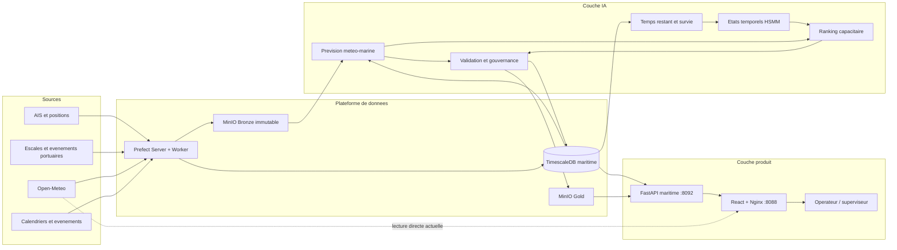
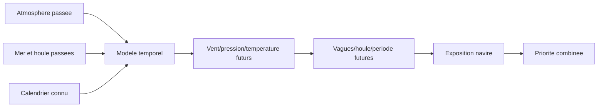
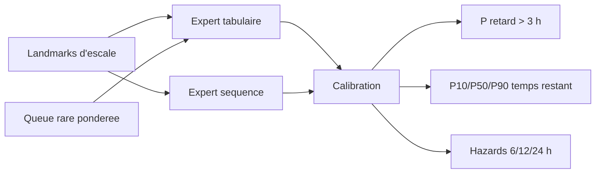
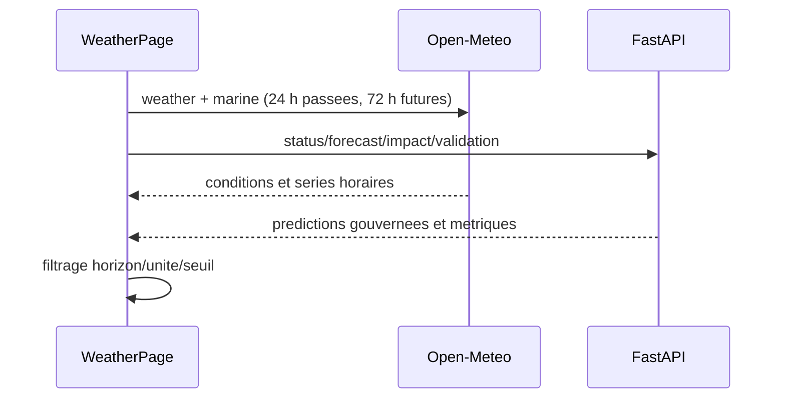
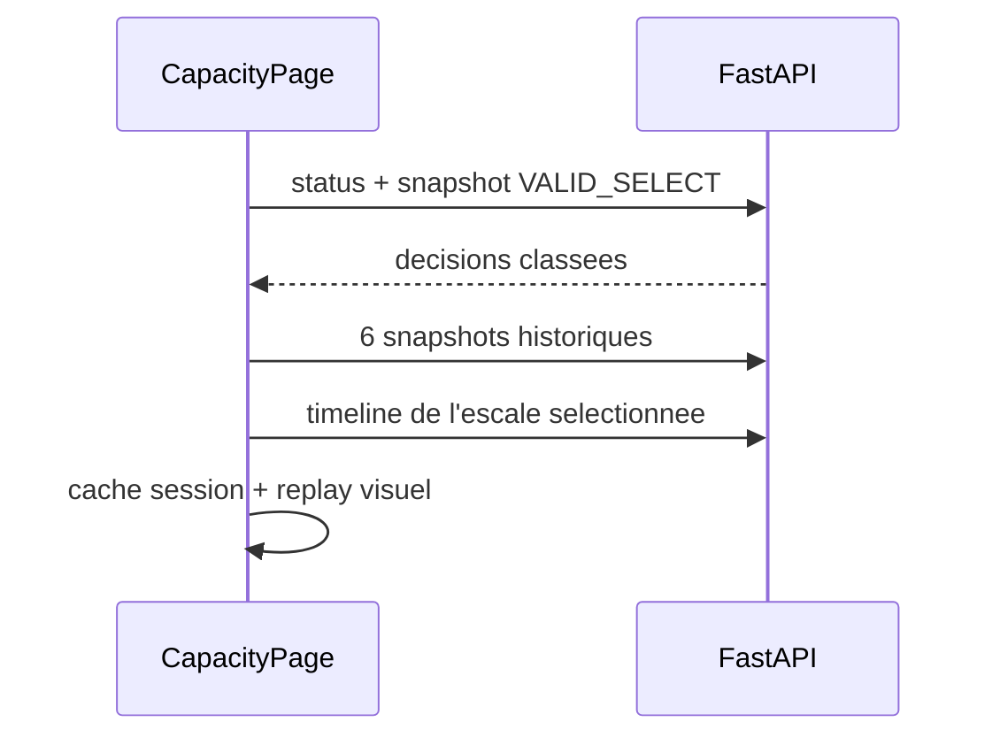

# PortFlow Maritime - Architecture technique detaillee

## 0. Statut et objectif du document

Ce guide est la reference de passation technique du sous-projet PortFlow Maritime. Il explique
comment le frontend React s'insere dans la plateforme complete : collecte, orchestration Prefect,
stockage MinIO et TimescaleDB, modelisation, gouvernance, FastAPI et publication Nginx.

Important : le depot `portflow-maritime` contient actuellement le frontend, son Dockerfile et ses
contrats TypeScript. Le code des flows Prefect, les migrations TimescaleDB, les modeles entraines
et le service FastAPI ne sont pas presents dans ce depot. Les elements backend ci-dessous sont
documentes a partir des contrats frontend et des executions observees. Ils doivent etre verifies
dans le futur depot backend avant modification.

Etat de confiance utilise dans ce document :

| Etiquette | Signification |
|---|---|
| `IMPLEMENTE-ICI` | Le code est present et verifiable dans ce depot. |
| `EXTERNE-OBSERVE` | Le composant a ete observe en execution, mais son code n'est pas ici. |
| `CONTRAT` | Le frontend depend explicitement de ce schema ou endpoint. |
| `CIBLE` | Architecture recommandee, pas encore implementee. |

## 1. Vue systeme



Principe fondamental : React ne doit jamais entrainer un modele, recalibrer une probabilite ou
ecrire directement dans TimescaleDB. Toutes les decisions scientifiques et les regles de
gouvernance appartiennent au backend.

## 2. Inventaire des conteneurs et responsabilites

Les noms suivants ont ete observes sur la station de developpement :

| Service | Port / acces | Responsabilite | Statut depot |
|---|---:|---|---|
| `spm-timescaledb` | interne Docker | Donnees temporelles, features et tables serving | `EXTERNE-OBSERVE` |
| `spm-minio` | `9000/9001` | Objets Bronze/Gold, rapports et modeles | `EXTERNE-OBSERVE` |
| `spm-storage-init` | job | Creation des buckets et initialisation | `EXTERNE-OBSERVE` |
| `spm-prefect-db` | interne | Metadonnees d'orchestration Prefect | `EXTERNE-OBSERVE` |
| `spm-prefect-redis` | interne | Coordination/queue Prefect | `EXTERNE-OBSERVE` |
| `spm-prefect-server` | `4200` | API et interface d'orchestration | `EXTERNE-OBSERVE` |
| `spm-prefect-worker` | interne | Execution Python des flows et taches | `EXTERNE-OBSERVE` |
| `spm-platform-api` | `8092` | FastAPI et contrats JSON metier | `EXTERNE-OBSERVE` |
| `spm-maritime-web` | `8088` | Nginx et bundle React | `IMPLEMENTE-ICI` en partie |

Ne pas confondre les deux bases PostgreSQL :

- `spm-prefect-db` contient les runs, deployments, schedules et etats Prefect ;
- `spm-timescaledb` contient les donnees maritimes et les sorties analytiques.

## 3. Couche d'orchestration Prefect

### 3.1 Role

Prefect est le planificateur et l'orchestrateur. Il doit :

1. declencher les collectes selon un horaire ;
2. executer les transformations dans le bon ordre ;
3. enregistrer progression, erreur, debut et fin ;
4. appliquer retries, timeouts et limites de ressources ;
5. verifier les contrats avant publication ;
6. rendre chaque run observable et reproductible.

Prefect ne doit pas devenir une base de donnees metier. Une tache Prefect ecrit des artefacts dans
MinIO/TimescaleDB, puis ne conserve dans Prefect que le statut d'execution et des references.

### 3.2 Familles de flows observees

| Famille | Fonction | Sortie principale |
|---|---|---|
| `B58C-D` | Collecte horaire meteo/marine issue-time | Snapshots immuables + lignes forecast |
| `B59A` | Audit des appels portuaires dynamiques | Rapport de disponibilite/qualite |
| `B60A` | Dataset horaire multitache | Dataset de modelisation |
| `B60A.1` | Audit de representation/features | Redondance et qualite des variables |
| `B60A.2` | Audit du signal predictif | Signal stable par cible/fold |
| `B60B` | Benchmark series temporelles | Comparaison baselines/NHITS/PatchTST |
| `B60C` | Landmarks operationnels d'escales | Dataset temps restant/risque |
| `B60C-H` | Contexte evenementiel historique | Features calendrier/evenements |
| `B61A` | Completion gouvernee des donnees | Dataset enrichi sans imputation cible |
| `B61A-X` | Augmentation gouvernee de queue rare | Challenger pondere separe |
| `B61B-v2` | Modelisation multitache hybride | Predictions risque/temps restant |
| `B61B-v2.1` | Recalibration sans reentrainement | Probabilites/intervalles recalibres |
| `B61C` | Replay historique et API shadow | Decisions temporelles rejouees |
| `B61D` | Famille HSMM et politiques d'etat | Etats latents et politiques challenger |
| `B61E` | Ranking temporel sous capacite | Watchlist top-k |
| `B62` | Cascade meteo -> vagues -> navires | Previsions probabilistes |
| `B62A` | Augmentation meteo-marine gouvernee | Challenger de queue/stress |
| `B62B` | Validation vintage/fresh-forward | Confirmation shadow |

Ces codes sont des identifiants de recherche et d'exploitation. Ils ne doivent pas apparaitre
dans les ecrans destines aux operateurs.

### 3.3 Contrat recommande d'un flow

Chaque flow doit publier une ligne d'audit avec au minimum :

```text
run_id
pipeline_name
model_version / dataset_version
status                 RUNNING | SUCCESS | FAILED
decision
started_at
finished_at
progress               JSON structure
error_message
critical_gates
production_allowed
next_block
```

Le champ `progress` doit etre mis a jour apres chaque etape couteuse. Un statut `RUNNING` dont la
date de progression est ancienne doit etre considere comme potentiellement interrompu.

### 3.4 Idempotence et concurrence

Les flows doivent etre idempotents : relancer le meme `force=false` ne doit pas dupliquer une
version deja validee. Une cle logique recommandee est :

```text
(pipeline_name, version, issue_at ou dataset_hash, parameter_hash)
```

Une nouvelle execution doit cloturer proprement les audits interrompus. Elle ne doit jamais
ecraser un artefact Gold valide sans creer une nouvelle version.

## 4. MinIO : stockage objet

### 4.1 Bronze immutable

Le Bronze conserve la reponse originale des sources externes. Exemple observe :

```text
s3://bronze-maritime/external/open-meteo/issue-time/
  endpoint=weather|marine/
  date=YYYY-MM-DD/
  issue_at=YYYYMMDDTHHMMSSZ/
  <sha256>.json
```

Metadonnees indispensables :

```text
endpoint_family
issue_at
requested_at
available_at
response_ms
payload_hash
object_uri
```

Le hash permet de verifier l'integrite et de dedupliquer les payloads. Un fichier Bronze ne doit
jamais etre modifie en place.

### 4.2 Gold versionne

Le Gold contient :

- datasets Parquet versionnes ;
- rapports CSV/JSON/HTML/PDF ;
- configurations de politiques ;
- artefacts de modeles ;
- manifestes avec source, version, hash, parametres et metriques.

Arborescence observee :

```text
s3://gold-maritime/datasets/<pipeline>/version=<n>/
s3://gold-maritime/reports/<pipeline>/version=<n>/
s3://gold-maritime/models/<pipeline>/version=<n>/
s3://gold-maritime/scenarios/<pipeline>/version=<n>/
```

Les scenarios synthetiques doivent rester dans une arborescence distincte des observations
reelles. Chaque ligne synthetique doit porter son role et son poids.

## 5. TimescaleDB : donnees temporelles et serving

### 5.1 Role

TimescaleDB centralise les series temporelles, landmarks d'escales, features, predictions,
replays et decisions exposees par FastAPI. Les hypertables sont utiles pour les gros volumes
indexes par temps, mais toutes les tables ne doivent pas devenir des hypertables.

Organisation logique recommandee :

| Schema | Contenu |
|---|---|
| `bronze` | References et metadonnees de collecte, pas les gros payloads JSON. |
| `core` | Entites nettoyees : escales, navires, observations, forecasts. |
| `feature` | Landmarks et features disponibles a un instant de decision. |
| `ml` | Predictions, calibrations, metriques et audits. |
| `serving` | Vues/tables stables lues par FastAPI. |

Cette organisation est une cible. Les migrations reelles ne sont pas dans le depot actuel : la
prochaine IA doit inspecter `information_schema`, les index et les contraintes avant de renommer
ou deplacer une table.

### 5.2 Tables serving observees

Les noms suivants sont apparus dans les executions :

```text
serving.maritime_port_call_multitask_prediction_v21
serving.maritime_port_call_decision_shadow_v1
serving.maritime_port_call_hsmm_shadow_v1
serving.maritime_port_call_anchored_hsmm_shadow_v11
serving.maritime_port_call_state_policy_shadow_v12
serving.maritime_port_call_dual_stage_shadow_v13
serving.maritime_capacity_watchlist_shadow_v1
```

Ces tables sont des sorties shadow/replay. Leur presence ne signifie pas qu'une promotion en
production est autorisee. FastAPI doit lire les indicateurs de gouvernance associes.

### 5.3 Semantique temporelle anti-fuite

La plateforme doit conserver plusieurs temps distincts :

| Champ | Sens |
|---|---|
| `issue_at` | Instant d'emission d'une prevision. |
| `requested_at` | Instant de l'appel a la source. |
| `available_at` | Instant ou l'information est effectivement disponible. |
| `valid_at` | Instant auquel la prevision s'applique. |
| `landmark_at` | Instant d'observation d'une escale. |
| `decision_at` | Instant de calcul de la recommandation. |
| `target_at` | Instant futur utilise pour definir la cible. |

Regles critiques :

```text
source_time <= available_at <= decision_at
landmark_at <= decision_at
target_at > decision_at
train.target_at < valid.decision_at
valid.target_at < test.decision_at
```

Les donnees retrospectives ERA5 peuvent servir a la recherche, mais ne doivent pas etre marquees
comme disponibles historiquement si elles ne l'etaient pas a l'instant de decision.

### 5.4 Index et contraintes attendus

- index sur `(port_call_id, decision_at)` ;
- index sur `(issue_at, valid_at, variable)` ;
- index sur `(evaluation_role, decision_at)` pour le ranking ;
- unicite de la cle versionnee des predictions ;
- `CHECK` sur les probabilites entre 0 et 1 ;
- `CHECK p10 <= p50 <= p90` lorsque les quantiles sont disponibles ;
- aucune suppression en cascade des audits/modeles publies.

## 6. Architecture de modelisation

### 6.1 Chaine meteo-marine



Familles observees : AutoGluon TimeSeries, Chronos-2, baselines temporelles et challengers
augmentes. Une tache est definie par `(variable, horizon)`. La selection doit utiliser VALID ;
TEST est diagnostic une seule fois. Les sorties sont probabilistes : P10, P50 et P90.

Variables importantes :

- temperature, pression, humidite, precipitation ;
- vitesse/direction/rafales de vent ;
- hauteur, direction et periode des vagues ;
- houle, temperature de mer et courant ;
- horizon, issue time et disponibilite operationnelle.

### 6.2 Chaine escale et temps restant



Les donnees synthetiques ne doivent pas remplacer les donnees reelles. Elles servent seulement a
un challenger pondere, selectionne sur VALID. Les cibles reelles et TEST restent immuables.

### 6.3 HSMM contextuel

Le HSMM represente des etats operationnels persistants, par exemple fluide, congestionne,
transition ou critique. Contrairement a un HMM simple, le HSMM modelise explicitement la duree
dans chaque etat.

Entrees : probabilites calibrees, hazards, temps restant, pression capacitaire et contexte.
Sorties : `hsmm_state`, confiance/posterieur, transitions et duree probable. Le HSMM est un
challenger explicatif. Il ne doit remplacer la politique retenue que si les gates de VALID et les
contraintes operationnelles sont satisfaits.

### 6.4 Ranking capacitaire

Le ranking transforme les scores en file de travail :

```text
score temporel + probabilite retard + hazards + etat HSMM + exposition meteo
                                  |
                                  v
                    tri dans une fenetre de 6 h
                                  |
                                  v
                         selection top-k
```

Le `top-k` represente une capacite de revue, pas le nombre total de cas a risque. Une escale non
selectionnee peut rester risquee ; elle n'entre simplement pas dans la capacite de la fenetre.

### 6.5 Gates de gouvernance

Avant publication, verifier :

- aucune fuite temporelle ;
- VALID utilise pour selection/calibration ;
- TEST non utilise pour choisir seuil/modeles ;
- couverture P10-P90 suffisante ;
- calibration des probabilites ;
- gain contre baseline avec intervalle de confiance ;
- aucune cible imputee ;
- donnees synthetiques identifiees et ponderees ;
- `automatic_action_allowed=false` tant que la validation operationnelle manque ;
- artefacts, metriques et versions ecrits avant activation serving.

## 7. FastAPI : couche d'acces produit

### 7.1 Responsabilites

FastAPI doit :

- lire les tables/vues `serving` ;
- convertir les types SQL en JSON serialisable ;
- exposer des contrats stables et versions ;
- propager la fraicheur et la gouvernance ;
- limiter, filtrer et paginer les resultats ;
- retourner des erreurs explicites sans exposer de secrets SQL.

Les erreurs historiques `Decimal is not JSON serializable` montrent que les resultats SQL doivent
etre normalises (`Decimal -> float/string`, timestamps -> ISO 8601) avant `json.dumps`.

### 7.2 Contrats consommes par le frontend

#### Replay et operations

```text
GET /api/v1/maritime/replay/range
GET /api/v1/maritime/replay/source-status
GET /api/v1/maritime/replay/snapshot?as_of=<ISO>
GET /api/v1/maritime/replay/timeline?end=<ISO>&horizon_h=<h>&hours=<n>
GET /api/v1/maritime/replay/metrics?end=<ISO>&days=<n>
GET /api/v1/maritime/replay/model-governance
GET /api/v1/maritime/replay/performance-history
GET /api/v1/maritime/replay/error-heatmap
GET /api/v1/maritime/operations/port-calls
GET /api/v1/maritime/operations/weather
GET /api/v1/maritime/operations/summary
GET /api/v1/maritime/operations/data-health
```

#### Meteo-marine

```text
GET /api/v1/maritime/metocean-cascade/status
GET /api/v1/maritime/metocean-cascade/forecast?track=<track>&limit=2000
GET /api/v1/maritime/metocean-cascade/vessel-impact?limit=500
GET /api/v1/maritime/metocean-augmentation/status
GET /api/v1/maritime/metocean-augmentation/selection
GET /api/v1/maritime/metocean-vintage-validation/status
GET /api/v1/maritime/metocean-vintage-validation/metrics
```

#### Capacite

```text
GET /api/v1/maritime/capacity-ranking/status
GET /api/v1/maritime/capacity-ranking/snapshot
GET /api/v1/maritime/capacity-ranking/port-calls/{port_call_id}/timeline
```

Les schemas exacts cote frontend sont dans `src/types/replay.ts`, `src/types/metocean.ts`,
`src/types/liveMetocean.ts` et `src/types/capacity.ts`.

### 7.3 Champs de gouvernance obligatoires

Les reponses scientifiques doivent conserver :

```text
model_version / policy_version
evaluation_role
production_promotion_allowed
production_claim_allowed
automatic_action_allowed
issue_at / valid_at / decision_at
source_model / selected_score
uncertainty_status
```

Le frontend doit afficher un statut degrade lorsque ces champs interdisent une utilisation
operationnelle.

## 8. Frontend React

### 8.1 Flux de requetes par page





Control Tower ne suit pas encore ce schema : ses donnees sont locales. C'est la dette fonctionnelle
principale du frontend.

### 8.2 Etat et cache

- React `useState/useEffect` pour le chargement ;
- `AbortController` pour annuler les requetes ;
- `Promise.allSettled` pour conserver les donnees partielles ;
- `sessionStorage` pour le dernier dashboard capacite et les timelines ;
- actualisation meteo et capacite toutes les cinq minutes ;
- aucune persistance de decision operateur.

### 8.3 Publication

Le Dockerfile realise un build multi-stage :

```text
node:22-alpine -> pnpm install -> pnpm build -> nginx:1.27-alpine
```

Nginx :

- sert `/usr/share/nginx/html` ;
- utilise `index.html` comme fallback SPA ;
- met les assets hashes en cache immutable ;
- ne met pas `index.html` en cache ;
- relaie `/api/` vers `host.docker.internal:8092` ;
- expose `/health`.

Le script `deploy-live-metocean-ui.ps1` publie aussi les sources dans un conteneur existant
`spm-maritime-web`, verifie Nginx, le bundle et les routes, puis teste le port Windows `8088`.

## 9. Reseau et configuration

| Variable / adresse | Usage |
|---|---|
| `VITE_API_BASE_URL` | Base FastAPI compilee dans le bundle Vite. |
| `http://localhost:8092` | FastAPI sur la machine hote. |
| `http://localhost:8088` | Frontend Nginx. |
| `http://localhost:4200` | Prefect UI. |
| `http://localhost:9001` | Console MinIO. |

Attention : les variables Vite sont injectees au build. Changer `VITE_API_BASE_URL` apres le build
ne modifie pas automatiquement le JavaScript publie. Pour une configuration runtime, ajouter un
fichier `config.json` ou `window.__PORTFLOW_CONFIG__` charge avant React.

## 10. Observabilite et diagnostics

### 10.1 Prefect

Surveiller : etat du flow, progression, duree, retries, worker, erreur Python et consommation RAM.
Un `SIGKILL -9` indique generalement une limite memoire ou une terminaison externe.

### 10.2 Docker

```powershell
docker ps
docker stats --no-stream
docker logs --since 15m --tail 200 spm-prefect-worker
docker logs --since 15m --tail 200 spm-platform-api
docker logs --since 15m --tail 200 spm-maritime-web
```

Les erreurs Docker Desktop `500 Internal Server Error`, `unexpected EOF` ou pipe LinuxEngine
signalent un probleme moteur Docker, pas necessairement une erreur applicative.

### 10.3 API et frontend

Verifier dans cet ordre :

```text
GET http://localhost:8092/health
GET http://localhost:8092/docs
GET http://localhost:8088/health
GET http://localhost:8088/weather
GET http://localhost:8088/capacity
```

Le frontend doit distinguer : chargement, donnees partielles, cache ancien, indisponibilite totale
et interdiction de production.

## 11. Securite et gouvernance d'acces

- ne jamais committer `.env`, mots de passe, tokens MinIO ou DSN PostgreSQL ;
- ne pas exposer les credentials dans les variables `VITE_*` : elles deviennent publiques ;
- placer l'authentification et l'autorisation dans FastAPI/reverse proxy ;
- utiliser TLS hors localhost ;
- journaliser l'utilisateur, le role et l'action de revue ;
- appliquer CORS explicitement ;
- limiter les endpoints lourds et paginer ;
- conserver un audit immutable de toute promotion de modele/politique.

## 12. Strategie de tests

### 12.1 Data et modeles

- tests de schema et contraintes temporelles ;
- tests de non-fuite ;
- reproductibilite par seed/version/hash ;
- rolling-origin validation ;
- calibration, couverture et quantile crossing ;
- comparaison baseline avec bootstrap par clusters temporels ;
- TEST gele et utilise une seule fois.

### 12.2 API

- tests de contrat JSON contre les types frontend ;
- serialisation Decimal/timestamp/NaN ;
- tests status 200/404/422/500 ;
- pagination, filtres et limites ;
- donnees partielles et absence de serving table ;
- interdiction d'action automatique.

### 12.3 React

- tests des transformations horizon/unite/seuil ;
- tests loading/error/empty/cached ;
- navigation clavier de la watchlist ;
- coherence desktop/mobile ;
- captures Playwright des trois routes ;
- absence de chevauchement et respect de `prefers-reduced-motion`.

## 13. Ce qui manque dans le depot GitHub actuel

Pour permettre a une autre IA de reproduire toute la plateforme, il faut encore versionner :

```text
services/platform_api/          FastAPI, routes, repositories SQL
flows/                          flows et tasks Prefect
db/migrations/                  schemas, tables, vues, index, contraintes
contracts/                      schemas JSON/OpenAPI partages
modeling/                       features, entrainement, calibration, evaluation
infra/                          compose Docker et initialisation MinIO
tests/backend/                  data, modeles et API
docs/model_cards/               limites et metriques par version
```

Sans ces elements, un clone de `portflow-maritime` reproduit l'interface, mais pas les predictions
ni les pipelines.

## 14. Architecture cible recommandee

Deux options correctes :

### Option A - Monorepo

```text
smart-port-maritime/
  apps/web/
  services/platform_api/
  flows/
  modeling/
  db/migrations/
  contracts/
  infra/
  tests/
  docs/
```

### Option B - Deux depots

```text
portflow-maritime-ui       React/Nginx
smart-port-maritime-core   Prefect/FastAPI/DB/modeles/infra
```

Dans les deux cas, OpenAPI doit devenir le contrat source. Les types TypeScript doivent etre
generes depuis OpenAPI ou verifies automatiquement en CI pour eviter la divergence API/UI.

## 15. Ordre de travail pour la prochaine IA

1. Cloner le frontend et lire `FRONTEND_HANDOFF.md` puis ce document.
2. Localiser ou creer le depot backend ; ne pas inventer son contenu.
3. Exporter le schema OpenAPI de FastAPI et comparer avec `src/types`.
4. Exporter la liste reelle des schemas/tables/index TimescaleDB.
5. Inventorier les deployments Prefect et leurs chemins sources.
6. Reproduire un run complet sur un petit echantillon.
7. Connecter Control Tower aux endpoints reellement disponibles.
8. Unifier la coque visuelle et supprimer les donnees fictives trompeuses.
9. Ajouter tests de contrat et CI avant toute nouvelle fonctionnalite.
10. Ne promouvoir aucune politique tant que la validation fresh-forward n'est pas suffisante.

## 16. Checklist de passation

- [ ] Le frontend build avec `pnpm build`.
- [ ] Les trois routes repondent via Nginx.
- [ ] FastAPI `/health` et `/docs` sont accessibles.
- [ ] Les contrats TypeScript correspondent a OpenAPI.
- [ ] TimescaleDB contient des tables serving versionnees.
- [ ] Prefect worker traite un flow de test sans SIGKILL.
- [ ] MinIO Bronze conserve hash et timestamps issue-time.
- [ ] Les roles TRAIN/VALID/TEST sont explicites.
- [ ] Les donnees synthetiques restent separees et ponderees.
- [ ] `automatic_action_allowed` reste faux dans les ecrans shadow.
- [ ] Les decisions operateur sont auditables avant production.
- [ ] Les limites scientifiques sont visibles dans les model cards.

## 17. References dans ce depot

- `FRONTEND_HANDOFF.md` : fonctionnement metier et visuel des trois pages.
- `README.md` : demarrage rapide du frontend.
- `DESIGN_SYSTEM.md` : regles visuelles.
- `src/services/` : endpoints effectivement appeles.
- `src/types/` : contrats JSON attendus.
- `src/pages/maritime/` : orchestration des pages.
- `src/components/sections/maritime/` : cartes et graphiques.
- `src/providers/ReplayProvider.tsx` : client replay actuellement global mais peu utilise.
- `Dockerfile` et `nginx.conf` : build et publication.
- `deploy-live-metocean-ui.ps1` : procedure locale de publication/verifications.
